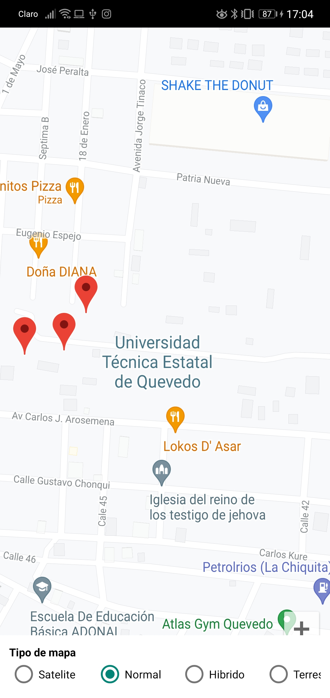
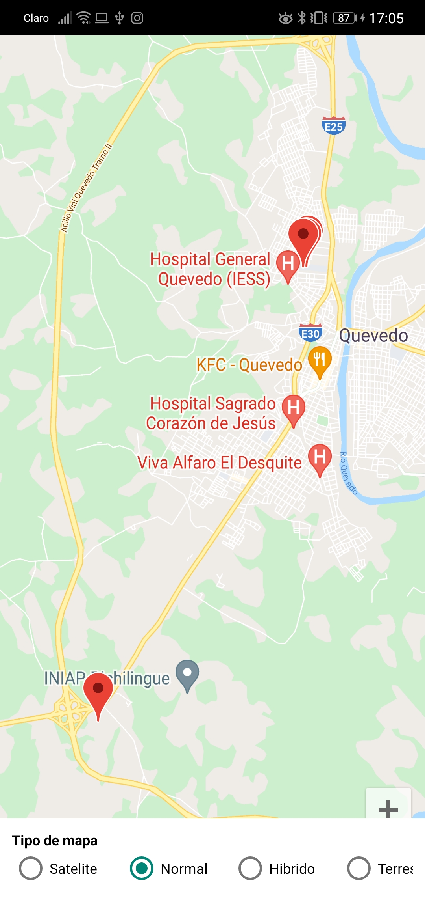
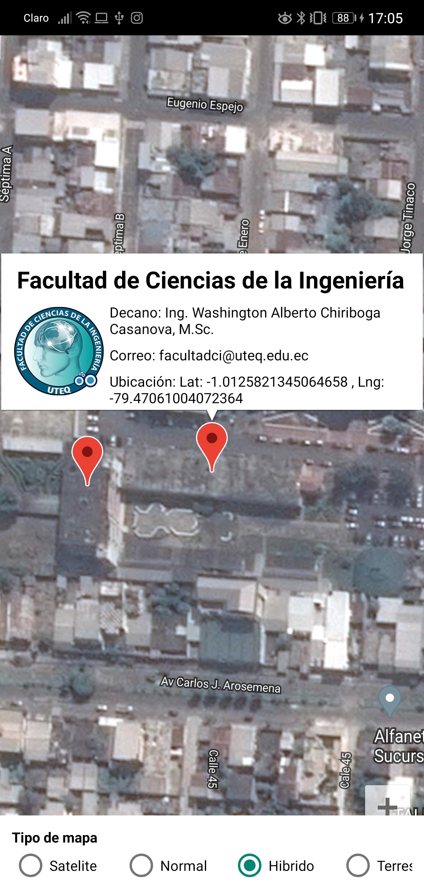
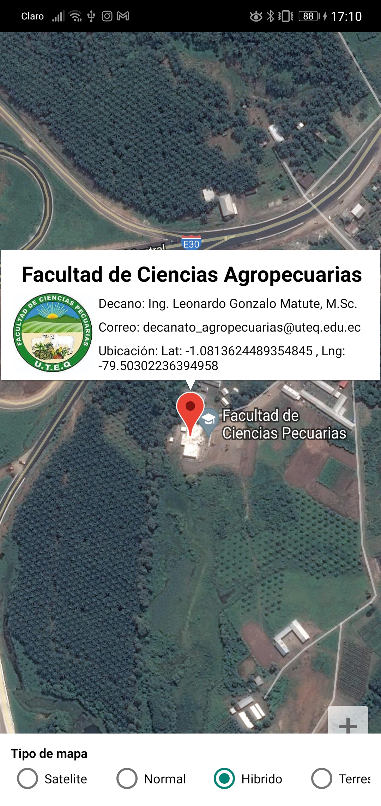

# Google-Maps
aplicación móvil con Google Maps

<h1>GOOGLE MAPS: MARCADORES CON INTERFAZ E INFORMACIÓN PERSONALIZADA</h1>
cuando se abre la aplicación aparece centrado el mapa en la universidad (UTEQ) 

A continucación se muestra todo los puntos  

A continucación se muestra detalles de los puntos 
 
 
 

